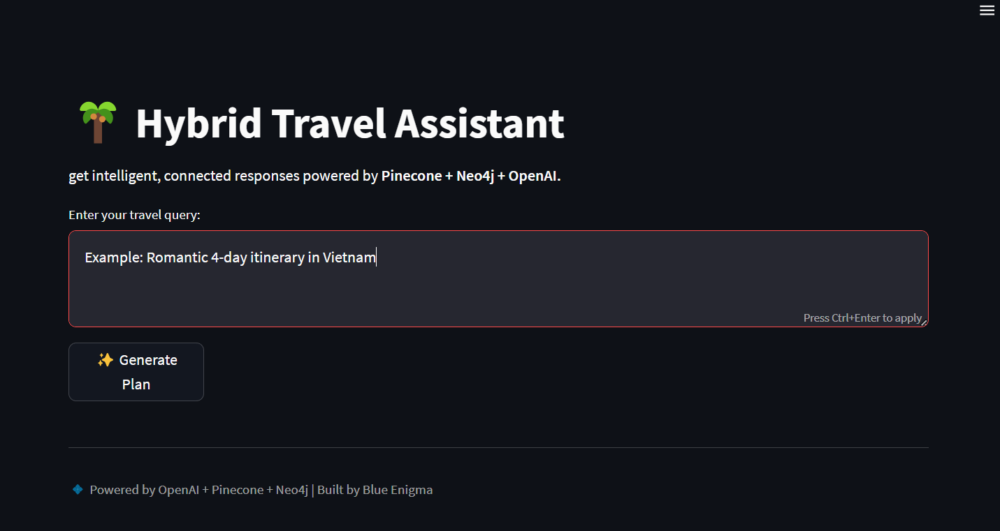
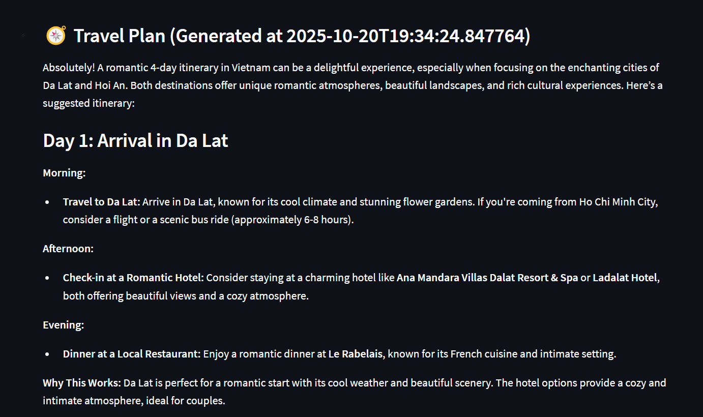
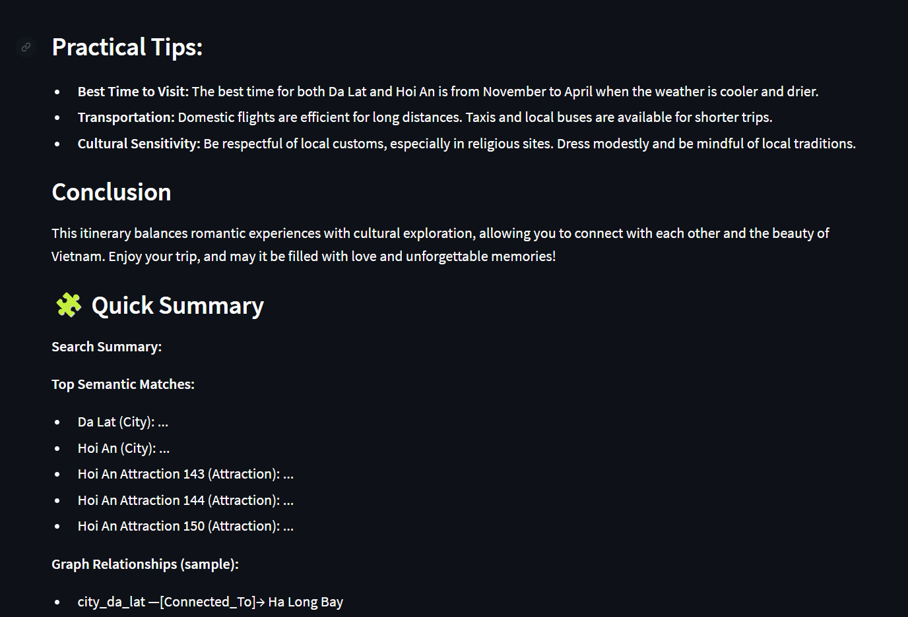

# 🌴 Hybrid AI Travel Assistant

> An intelligent travel planning system combining semantic search, knowledge graphs, and LLM reasoning to deliver personalized travel recommendations.

[](https://www.python.org/downloads/)
[](https://opensource.org/licenses/Apache-2.0)

---

## 📖 Overview

The Hybrid AI Travel Assistant leverages the complementary strengths of multiple AI technologies:

- **Pinecone**: Semantic vector search for understanding travel intent
- **Neo4j**: Graph database for structured relationship queries  
- **OpenAI GPT**: Natural language understanding and itinerary generation
- **Streamlit**: Interactive visualization and exploration interface

This hybrid approach grounds LLM responses with structured data while maintaining semantic understanding of user queries.

---

## ✨ Key Features

| Feature | Description |
|---------|-------------|
| 🔍 **Hybrid Retrieval** | Combines vector similarity search with graph traversal for accurate, contextual results |
| 🧠 **Intelligent Reasoning** | Uses GPT models to synthesize information and generate personalized itineraries |
| ⚡ **Async Architecture** | Non-blocking I/O with `asyncio` for high-performance concurrent operations |
| 💾 **Smart Caching** | In-memory caching reduces API calls and improves response times |
| 🛡️ **Robust Error Handling** | Graceful fallbacks, custom exceptions, and automatic retry mechanisms |
| 📊 **Interactive Visualization** | Streamlit dashboard with live knowledge graph exploration |
| 🔧 **Developer Tools** | CLI interface, data loading scripts, and comprehensive logging |

---

## 🏗️ Architecture

```
┌─────────────────────────────────────────────────────────┐
│                    Streamlit UI                         │
│         (User Query + Graph Visualization)              │
└────────────────────────┬────────────────────────────────┘
                         │
                         ▼
┌─────────────────────────────────────────────────────────┐
│                  HybridChat Orchestrator                │
│              (Async Pipeline Coordinator)               │
└───┬──────────────────┬──────────────────┬───────────────┘
    │                  │                  │
    ▼                  ▼                  ▼
┌─────────┐      ┌──────────┐      ┌────────────────┐
│Pinecone │      │  Neo4j   │      │ PromptBuilder  │
│Vector DB│      │Graph DB  │      │   + OpenAI     │
└─────────┘      └──────────┘      └────────────────┘
    │                  │                  │
    └──────────────────┴──────────────────┘
                       │
                       ▼
              ┌────────────────┐
              │  AI Response   │
              │ (Grounded Plan)│
              └────────────────┘
```
---

### Design Principles

- **Separation of Concerns**: Retrievers, LLM client, and orchestration logic are fully decoupled
- **Modularity**: Each component can be tested, updated, or replaced independently
- **Extensibility**: Abstract interfaces allow swapping backends (e.g., Weaviate instead of Pinecone)

---

## ⚙️ Workflow

1. **User Query:** The traveler enters a request (e.g., “Romantic 4-day itinerary in Vietnam”).  
2. **Semantic Retrieval:** Pinecone retrieves top related nodes based on embeddings.  
3. **Graph Retrieval:** Neo4j fetches connected destinations, attractions, and relationships.  
4. **Prompt Assembly:** `PromptBuilder` combines semantic + graph context into a structured LLM prompt.  
5. **Reasoning:** OpenAI GPT model generates a rich, personalized plan.  
6. **Response Display:** The Streamlit UI shows the itinerary, summary, and live interactive graph.


---

## 📁 Project Structure

```
hybrid_ai_travel_assistant/
├── app/
│   ├── retrievers/
│   │   ├── pinecone_retriever.py    # Semantic search
│   │   └── neo4j_retriever.py       # Graph queries
│   ├── llm/
│   │   ├── llm_client.py            # OpenAI wrapper
│   │   └── prompt_builder.py        # Context assembly
│   ├── hybrid/
│   │   ├── hybrid_retriever.py      # Retrieval orchestration
│   │   └── hybrid_chat.py           # Main reasoning engine
│   ├── config_loader.py             # Environment config
│   ├── exceptions.py                # Custom error types
│   └── logger.py                    # Logging setup
│
├── scripts/
│   ├── load_to_neo4j.py            # Data ingestion
│   ├── upload_to_pinecone.py       # Vector indexing
│   ├── visualize_graph.py          # Graph visualization
│   └── chat_cli.py                 # Interactive CLI
│
├── data/
│   └── vietnam_travel_dataset.json
│
├── tests/                          # Unit tests
├── logs/                           # Application logs
├── requirements.txt
├── .env.example                    # Environment template
└── README.md
```

---

## 🚀 Quick Start

### Prerequisites

- Python 3.8+
- Neo4j (local or cloud instance)
- API keys for OpenAI and Pinecone

### 1. Clone & Setup Environment

```bash
# Clone repository
git clone https://github.com/yourusername/hybrid-travel-assistant.git
cd hybrid-travel-assistant

# Create virtual environment
python -m venv venv
source venv/bin/activate  # Windows: venv\Scripts\activate

# Install dependencies
pip install -r requirements.txt
```

### 2. Configure Environment Variables

Create a `.env` file in the project root:

```ini
# OpenAI
OPENAI_API_KEY=sk-...

# Pinecone
PINECONE_API_KEY=your-pinecone-key
PINECONE_INDEX_NAME=vietnam-travel
PINECONE_VECTOR_DIM=1536

# Neo4j
NEO4J_URI=bolt://localhost:7687
NEO4J_USER=neo4j
NEO4J_PASSWORD=your-password

# Optional
TOP_K=5
LOG_LEVEL=INFO
```

### 3. Load Data

```bash
# Load graph data into Neo4j
python -m scripts.load_to_neo4j

# Generate embeddings and upload to Pinecone
python -m scripts.upload_to_pinecone

# (Optional) Visualize the knowledge graph
python -m scripts.visualize_graph
```

### 4. Run the Application

**Interactive CLI:**
```bash
python -m scripts.chat_cli
```

**Streamlit CLI:**
```bash
python -m streamlit run scripts/chat_ui.py
```

---

## 💻 Usage Examples


## 🖥️ Streamlit Interface

### ✨ Chat UI Screenshot







*(Example: Romantic 4-day itinerary in Vietnam — full reasoning and graph visualization.)*

---

### Command-Line Interface

```bash
$ python -m scripts.chat_cli

🌴 Hybrid Travel Assistant
Type your travel question (or 'exit' to quit):

> Create a romantic 4-day itinerary for Vietnam

🔍 Retrieving semantic matches...
🔗 Fetching graph context...
🤖 Generating personalized itinerary...

Here's your romantic 4-day Vietnam itinerary:
...
```

### Python API

```python
from app.hybrid.hybrid_chat import HybridChat

chat = HybridChat()
result = chat.handle_query("Best beaches in Vietnam for diving")

print(result["answer"])
print(f"Found {len(result['matches'])} semantic matches")
print(f"Retrieved {len(result['graph_facts'])} graph facts")

chat.close()
```

---

## 🧪 Testing

Run the test suite:

```bash
# Run all tests
pytest tests/

# Test specific component
python -m tests.test_hybrid_chat

# Test Pinecone connection
python -m tests.test_pinecone_retriever
```

---

## 💡 Design Rationale

### Why Hybrid Retrieval?

| Approach | Strengths | Use Case |
|----------|-----------|----------|
| **Vector Search (Pinecone)** | Semantic understanding, fuzzy matching | "Find peaceful destinations" |
| **Graph DB (Neo4j)** | Structured relationships, multi-hop queries | "Hotels near museums with vegan restaurants" |
| **Hybrid** | Best of both worlds + grounded reasoning | Complex, contextual travel planning |

**Key Benefits:**
- ✅ Semantic search finds relevant concepts
- ✅ Graph queries enforce logical constraints
- ✅ Combined context prevents hallucination
- ✅ Improved accuracy and explainability

---

## 📈 Scaling to 1M+ Nodes

### Database Optimization

**Neo4j:**
- Use Enterprise Edition with causal clustering
- Implement read replicas for query distribution
- Partition data by region/type
- Index frequently queried properties
- Limit result set sizes

**Pinecone:**
- Use namespaces for logical separation
- Implement vector quantization (IVF/PQ)
- Consider sharding for very large datasets
- Cache hot queries in Redis

### Application Architecture

```
┌─────────────┐
│ Load Bal.   │
└──────┬──────┘
       │
   ┌───┴───┬────────┬────────┐
   ▼       ▼        ▼        ▼
┌─────┐ ┌─────┐  ┌─────┐  ┌─────┐
│API 1│ │API 2│  │API 3│  │API 4│
└──┬──┘ └──┬──┘  └──┬──┘  └──┬──┘
   │       │        │        │
   └───────┴────────┴────────┘
                │
          ┌─────┴─────┐
          ▼           ▼
        ┌────────┐  ┌────────┐
        │ Redis  │  │Pinecone│
        │ Cache  │  │ Neo4j  │
        └────────┘  └────────┘
```

**Strategies:**
- Deploy as microservices (FastAPI)
- Implement Redis caching layer
- Use connection pooling
- Enable horizontal autoscaling
- Monitor with Prometheus/Grafana

---

## 🛡️ Error Handling & Reliability

### Failure Modes

| Issue | Mitigation |
|-------|------------|
| Database downtime | Graceful degradation (single-source mode) |
| API rate limits | Exponential backoff with jitter |
| Token limit exceeded | Context trimming and prioritization |
| Data inconsistency | Versioning and checkpointing |
| Model hallucination | Citation of sources, confidence scoring |

### Circuit Breaker Pattern

```python
# Automatic fallback if Neo4j is unavailable
try:
    graph_facts = neo4j_retriever.fetch_context(node_ids)
except GraphError:
    logger.warning("Neo4j unavailable, falling back to semantic-only")
    graph_facts = []
```

---

## 🔮 Future Enhancements

- [ ] Multi-language support (embedding models)
- [ ] User preference learning (collaborative filtering)
- [ ] Real-time price integration
- [ ] Mobile app (React Native)
- [ ] Voice interface (Whisper API)
- [ ] A/B testing framework for prompt optimization
- [ ] GraphRAG for advanced reasoning
- [ ] Integration with booking APIs

---

## 🤝 Contributing

Contributions are welcome! Please follow these steps:

1. Fork the repository
2. Create a feature branch (`git checkout -b feature/amazing-feature`)
3. Commit your changes (`git commit -m 'Add amazing feature'`)
4. Push to the branch (`git push origin feature/amazing-feature`)
5. Open a Pull Request

---

## 📄 License

This project is licensed under the Apache License 2.0 - see the [LICENSE](LICENSE) file for details.

---

## 🙏 Acknowledgments

- OpenAI for GPT models and embeddings
- Pinecone for vector database infrastructure
- Neo4j for graph database technology
- The Python community for excellent libraries

---

## 📧 Contact

For questions or feedback, please open an issue or contact:
- **Email**: your.email@example.com
- **GitHub**: [@yourusername](https://github.com/yourusername)

---

<div align="center">
  <strong>Built with ❤️ for intelligent travel planning</strong>
</div>